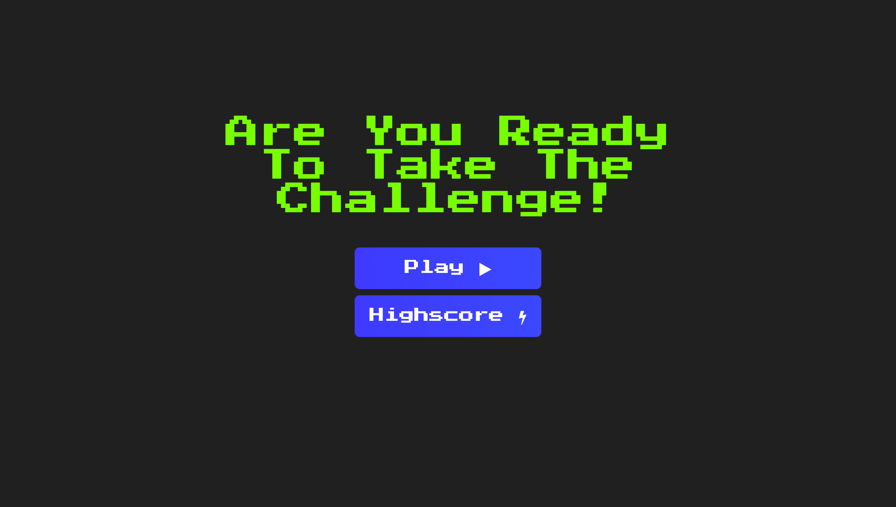

# Challenge Quiz

Table of Contents

  <ol>
    <li>
      <a href="#about-the-project">About The Project</a>
      <ul>
        <li><a href="#built-with">Built With</a></li>
      </ul>
    </li>
    <li><a href="#features">Features</a></li>
    <li><a href="#validation">Validation</a></li>
    <li><a href="#contributing">Contributing</a></li>
    <li><a href="#deployment">Deployment</a></li>
    <li><a href="#contact">Contact</a></li>
    <li><a href="#acknowledgments">Acknowledgments</a></li>
  </ol>

  ## About the Project
Challenge quiz is an online general knowledge quiz creaded using HTML, CSS and JavaScript . 
This project is intended to be submitted to Code Institute for assesment.
### Built With
* [HTML 5
(HyperText Markup Language)](https://en.wikipedia.org/wiki/HTML)
* [CSS (Cascading Style Sheets)](https://en.wikipedia.org/wiki/CSS)
* [JavaScript](https://en.wikipedia.org/wiki/JavaScript)
* [Visual Studio Code](https://code.visualstudio.com/)
* [GitHub](https://github.com/)
* [GitHub Pages](https://pages.github.com/)

## Features
Challenge Quiz is designed for straight forward use and relys on the users general knowledge to use.

### Responsive Design
* Website is designed to be used across multiple devices

### Landing Page
* The landing page is equipped with many navigation features.

### Interactive Elements
* When the user selects a correct answer or an incorrect answer the answer is displayed as either Green or Red

## Validation
* Passed the HTML Validator with no errors
* Passed the CSS Validator with no errors
* Passed the Javascript Validator with no Issues

## Contributing
1. Fork the Project
2. Create your Feature Branch
3. Commit your Changes
4. Push to the Branch
5. Open a Pull Request

## Deployment 
Introspective Lifestyle was deployed to [GitHub Pages](https://pages.github.com/)

## Contact
Jack Pitman - PitmanJack2@gmail.com  
GitHub Repo [Project Link](https://github.com/JPitman26/Project-2-Quiz)

## Acknowledgments
* [Font Awesome Icons](https://fontawesome.com/v4.7/)
* [Code Research](https://developer.mozilla.org/en-US/)
* [Font From GoogleFonts](https://www.googlefonts.com)
* [HTML Validation](https://validator.w3.org/nu/)
* [CSS Validation](https://jigsaw.w3.org/css-validator/validator)
* [Am I Responsive](http://ami.responsivedesign.is/#)
* [Colour Wheel](https://www.canva.com/colors/color-wheel/)
* HTML Boilerplate - VS Code Extensions - sidthesloth
* Markdown All in One - VS Code Extensions - Yu Zhang